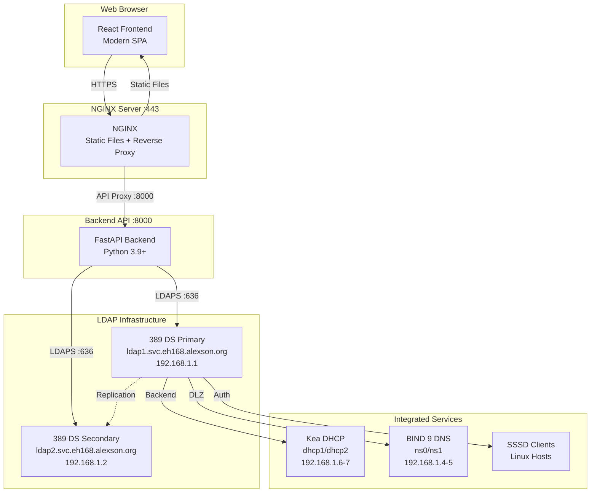

# LDAP Web Manager v2.0.0

**Complete infrastructure management platform for 389 Directory Service with integrated IPAM, DNS, DHCP, and user/group management.**


---

## 🌟 Overview

LDAP Web Manager is a comprehensive web application for managing your entire network infrastructure through a unified interface. Built with modern web technologies and designed to run on NGINX.

### Architecture



---

## ✨ Features

### 📋 User & Group Management ✅ **COMPLETE**
- ✅ **User Management**: Create, edit, delete, and search users
- ✅ **Group Management**: Manage POSIX groups and memberships
- ✅ **Password Management**: Reset passwords, enforce complexity policies
- ✅ **Service Accounts**: View and manage dedicated service accounts
- ✅ **Automatic UID/GID**: Auto-generation of unique identifiers
- ✅ **Full POSIX Support**: Home directories, shells, gecos fields
- ✅ **Search & Pagination**: Fast access to users and groups
- ✅ **Permission-Based UI**: Role-based action visibility

### 🌍 DNS Management (BIND 9) ✅ **COMPLETE**
- ✅ **Zone Management**: Create, edit, delete forward and reverse zones
- ✅ **SOA Records**: Full SOA parameter control with auto-increment serial
- ✅ **Record Management**: Support for A, AAAA, CNAME, MX, TXT, PTR, SRV, NS records
- ✅ **DLZ Integration**: Native 389 DS LDAP backend for BIND 9
- ✅ **Zone Statistics**: View zone counts and details
- ✅ **Validation**: Real-time syntax checking for DNS records
- ✅ **Search & Pagination**: Fast zone lookup

### 🔌 DHCP Management (Kea) ✅ **COMPLETE**
- ✅ **Subnet Management**: Configure IPv4 subnets with CIDR notation
- ✅ **Static Reservations**: MAC-to-IP mappings for hosts
- ✅ **DHCP Options**: Configure DNS servers, gateways, domain names
- ✅ **DHCP Ranges**: Define dynamic IP address pools
- ✅ **Statistics**: View subnet counts, static hosts, IP utilization
- ✅ **Kea LDAP Backend**: Full integration with Kea DHCP server
- ✅ **Search & Pagination**: Fast subnet lookup
- ✅ **Dashboard Integration**: Real-time DHCP statistics

### 🌐 IPAM (IP Address Management) ✅ **COMPLETE** (API)
- ✅ **IP Pool Management**: Create and manage IP address pools (CIDR)
- ✅ **IP Allocation Tracking**: Track static, DHCP, reserved, infrastructure IPs
- ✅ **IP Search**: Find allocations by IP, hostname, or MAC address
- ✅ **Conflict Detection**: Prevent duplicate IP assignments
- ✅ **Utilization Tracking**: Monitor used vs. available addresses per pool
- ✅ **VLAN Support**: Associate pools with VLANs
- ✅ **Gateway & DNS**: Configure per-pool network settings
- ✅ **Statistics API**: Comprehensive IPAM metrics
- 📋 **Visual UI**: Planned for v2.1.0 (API fully functional)

### 🔐 Security & Authentication
- ✅ **LDAPS**: Encrypted connections to 389 DS
- ✅ **Role-Based Access Control (RBAC)**: Admin, Operator, Read-Only roles
- ✅ **Session Management**: Secure JWT-based authentication
- ✅ **Audit Trail**: Complete change history
- ✅ **API Security**: Rate limiting and input validation

### 🎨 User Experience
- ✅ **Modern UI**: Responsive design with Tailwind CSS
- ✅ **Dark Mode**: Toggle between light and dark themes
- ✅ **Search & Filter**: Quick access to any resource
- ✅ **Dashboard**: Overview of infrastructure health
- ✅ **Real-Time Updates**: Live status indicators
- ✅ **Mobile Friendly**: Works on tablets and smartphones

---

## 🚀 Quick Start

### Prerequisites

- **NGINX 1.24+** installed on Rocky Linux 8 or similar
- **Python 3.9+** for the backend API
- **Node.js 18+** and npm/yarn for frontend development (production uses pre-built files)
- **389 Directory Service** deployed and accessible
- **TLS Certificates** for HTTPS (Let's Encrypt, self-signed, or corporate CA)

### Installation

#### Option 1: Automated Deployment (Recommended)

```bash
# Clone the repository
git clone https://github.com/infrastructure-alexson/ldap-web-manager.git
cd ldap-web-manager

# Configure settings
cp config/app-config.example.yaml config/app-config.yaml
nano config/app-config.yaml  # Edit LDAP connection details

# Run the deployment script
sudo ./scripts/deploy-full.sh

# Access the web interface
firefox https://ldap-manager.eh168.alexson.org
```

#### Option 2: Manual Deployment

See: [doc/INSTALLATION.md](doc/INSTALLATION.md)

---

## 📁 Project Structure

```
ldap-web-manager/
├── frontend/                      # React SPA frontend
│   ├── src/
│   │   ├── components/           # React components
│   │   │   ├── Users/            # User management UI
│   │   │   ├── Groups/           # Group management UI
│   │   │   ├── DNS/              # DNS zone/record management
│   │   │   ├── DHCP/             # DHCP subnet/pool management
│   │   │   ├── IPAM/             # IP address management
│   │   │   └── Dashboard/        # Overview dashboard
│   │   ├── api/                  # API client
│   │   ├── hooks/                # Custom React hooks
│   │   ├── utils/                # Helper functions
│   │   └── App.jsx               # Main application
│   ├── public/                   # Static assets
│   └── package.json              # Frontend dependencies
│
├── backend/                       # Python FastAPI backend
│   ├── app/
│   │   ├── api/                  # API routes
│   │   │   ├── users.py          # User management endpoints
│   │   │   ├── groups.py         # Group management endpoints
│   │   │   ├── dns.py            # DNS management endpoints
│   │   │   ├── dhcp.py           # DHCP management endpoints
│   │   │   └── ipam.py           # IPAM endpoints
│   │   ├── models/               # Data models (Pydantic)
│   │   ├── ldap/                 # LDAP connection & operations
│   │   ├── auth/                 # Authentication & authorization
│   │   └── main.py               # FastAPI application
│   ├── tests/                    # Unit and integration tests
│   └── requirements.txt          # Python dependencies
│
├── config/                        # Configuration files
│   ├── app-config.yaml           # Application settings
│   ├── nginx.conf                # NGINX configuration
│   └── systemd/                  # Systemd service files
│
├── scripts/                       # Deployment scripts
│   ├── deploy-full.sh            # Complete deployment
│   ├── deploy-backend.sh         # Deploy API backend
│   ├── deploy-frontend.sh        # Build and deploy frontend
│   ├── setup-nginx.sh            # Configure NGINX
│   └── backup-config.sh          # Backup configurations
│
├── doc/                           # Documentation
│   ├── INSTALLATION.md           # Detailed installation guide
│   ├── API.md                    # REST API documentation
│   ├── NGINX-SETUP.md            # NGINX configuration guide
│   ├── USER-GUIDE.md             # End-user documentation
│   └── DEVELOPMENT.md            # Developer guide
│
├── nginx/                         # NGINX-specific files
│   ├── sites-available/          # NGINX site configs
│   │   └── ldap-manager.conf     # Main site configuration
│   └── ssl/                      # TLS certificate location
│
└── README.md                      # This file
```

---

## 🖥️ Technology Stack

### Frontend
- **React 18** - Modern UI framework
- **Vite** - Fast build tool
- **Tailwind CSS** - Utility-first CSS framework
- **React Router** - Client-side routing
- **Axios** - HTTP client
- **React Query** - Data fetching and caching
- **Formik + Yup** - Form handling and validation
- **Chart.js** - Data visualization

### Backend
- **FastAPI** - Modern Python web framework
- **Python-LDAP** - LDAP client library
- **Pydantic** - Data validation
- **Uvicorn** - ASGI server
- **JWT** - Authentication tokens
- **SQLite** - Local cache and audit logs

### Web Server
- **NGINX** - High-performance web server and reverse proxy
- **Certbot** - Let's Encrypt SSL certificate management

---

## 🔧 Configuration

### LDAP Connection

Edit `config/app-config.yaml`:

```yaml
ldap:
  servers:
    primary: ldaps://ldap1.svc.eh168.alexson.org:636
    secondary: ldaps://ldap2.svc.eh168.alexson.org:636
  base_dn: dc=eh168,dc=alexson,dc=org
  bind_dn: cn=webmanager,ou=ServiceAccounts,dc=eh168,dc=alexson,dc=org
  bind_password: ${LDAP_PASSWORD}  # Use environment variable
  
  # Organizational Units
  users_ou: ou=People,dc=eh168,dc=alexson,dc=org
  groups_ou: ou=Groups,dc=eh168,dc=alexson,dc=org
  dns_ou: ou=DNS,ou=Services,dc=eh168,dc=alexson,dc=org
  dhcp_ou: ou=DHCP,ou=Services,dc=eh168,dc=alexson,dc=org
```

### NGINX Configuration

Served by NGINX on port 443 with reverse proxy to FastAPI backend on port 8000.

See: [doc/NGINX-SETUP.md](doc/NGINX-SETUP.md)

---

## 📊 Dashboard Features

The main dashboard provides:
- **Infrastructure Health**: Status of LDAP, DNS, and DHCP services
- **Quick Stats**: User count, group count, DNS zones, DHCP subnets
- **Recent Activity**: Latest changes and operations
- **IP Utilization**: Visual representation of address pool usage
- **Alerts**: Warnings for conflicts, expiring certificates, replication issues

---

## 🔒 Security Considerations

1. **LDAPS Only**: All LDAP connections use TLS encryption
2. **Service Account**: Web manager uses dedicated read/write service account
3. **HTTPS Required**: Frontend served only over HTTPS
4. **RBAC**: Role-based access control for different user types
5. **Input Validation**: All API inputs validated and sanitized
6. **Audit Logging**: All operations logged with user, timestamp, and changes
7. **Rate Limiting**: API rate limiting to prevent abuse

---

## 📖 Documentation

- [Installation Guide](doc/INSTALLATION.md) - Complete installation instructions
- [NGINX Setup](doc/NGINX-SETUP.md) - Web server configuration
- [API Documentation](doc/API.md) - REST API reference
- [User Guide](doc/USER-GUIDE.md) - End-user documentation
- [Development Guide](doc/DEVELOPMENT.md) - For contributors

---

## 🤝 Related Projects

This project integrates with:
- [389ds-ldap-server](https://github.com/infrastructure-alexson/389ds-ldap-server) - LDAP backend
- [kea-dhcp-server](https://github.com/infrastructure-alexson/kea-dhcp-server) - DHCP server
- [bind9-dns-server](https://github.com/infrastructure-alexson/bind9-dns-server) - DNS server
- [ldap-sssd-auth](https://github.com/infrastructure-alexson/ldap-sssd-auth) - Client authentication

---

## 📝 License

MIT License - See [LICENSE](LICENSE) file for details

---

## 🛠️ Support

- **Issues**: https://github.com/infrastructure-alexson/ldap-web-manager/issues
- **Discussions**: https://github.com/infrastructure-alexson/ldap-web-manager/discussions

---

**Built for the eh168.alexson.org infrastructure** 🚀

