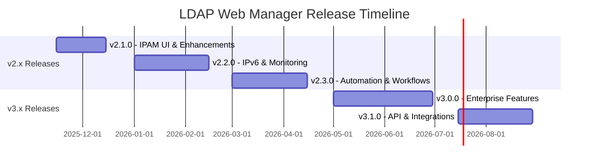

# LDAP Web Manager - Product Roadmap

This document outlines the planned features and enhancements for future versions of LDAP Web Manager.

**Current Version**: 2.0.0  
**Last Updated**: 2025-11-03  
**Planning Horizon**: 12-18 months

---

## Overview

LDAP Web Manager has achieved its v2.0 milestone with complete backend APIs for Users, Groups, DNS, DHCP, and IPAM. The roadmap focuses on:

1. **Completing Frontend UI** for all backend features
2. **Enhanced User Experience** with visual tools and bulk operations
3. **Advanced Features** like monitoring, automation, and reporting
4. **Enterprise Features** for larger deployments
5. **Integration & Extensibility** with third-party tools

---

## Release Timeline

---

## v2.1.0 - UI Completion & User Experience 🎨

**Target Release**: Mid-November 2025  
**Focus**: Complete frontend UI for existing backend features

### IPAM Visual Interface ⭐ **HIGH PRIORITY**

**Status**: Backend complete, frontend needed

- **IP Allocation Map**: Visual grid showing IP usage
  - Color-coded status (free, allocated, reserved, infrastructure)
  - Click to allocate/release IPs
  - Hover for IP details (hostname, MAC, allocation type)
  - Filter by status, pool, VLAN
  
- **Subnet Calculator**: Interactive tool for CIDR planning
  - CIDR to IP range conversion
  - Subnet splitting/merging
  - Address count calculations
  - Network/broadcast identification

- **IP Search & Discovery**:
  - Advanced search form (IP, hostname, MAC, allocation type)
  - Search results with context (pool, VLAN, gateway)
  - Bulk export of search results

- **Pool Management UI**:
  - Create/edit IP pools with CIDR notation
  - Configure VLAN, gateway, DNS servers
  - View pool utilization charts
  - Manage allocations within pool

### Audit Log Viewer

**Status**: Backend logging exists, viewer needed

- Web-based log viewer with filtering
- Search by user, action, resource, date range
- Export logs to CSV/JSON
- Real-time log streaming (WebSocket)
- Compliance reporting templates

### Bulk Operations

**Status**: API supports individual operations, batch UI needed

- **Bulk User Import**: CSV/LDIF upload with validation
- **Bulk User Export**: Export users with filters to CSV/LDIF
- **Bulk Password Reset**: Reset multiple users at once
- **Bulk Group Membership**: Add/remove multiple users to/from groups
- **Bulk DNS Records**: Import zone files, export records
- **Bulk IP Allocation**: Allocate ranges from CSV

### Enhanced UI Components

- **User Profile Page**: View/edit detailed user information
- **Group Details Page**: Members list, nested groups, permissions
- **DNS Zone Editor**: Visual zone file editor with syntax highlighting
- **DHCP Subnet Wizard**: Step-by-step subnet configuration
- **Dashboard Widgets**: Customizable widget layout
- **Dark Mode**: Toggle between light and dark themes

### Documentation

- User guide with screenshots
- Video tutorials for common tasks
- API client examples (Python, JavaScript, curl)

---

## v2.2.0 - IPv6 & Monitoring 🌐

**Target Release**: Early 2026  
**Focus**: IPv6 support and infrastructure monitoring

### IPv6 Support

**Status**: Currently IPv4 only

- **IPAM IPv6**: Support for IPv6 pools and allocations
  - IPv6 CIDR notation (e.g., 2001:db8::/32)
  - IPv6 address validation
  - Dual-stack (IPv4 + IPv6) pools
  
- **DNS IPv6 Records**:
  - AAAA record support (already in backend, enhance UI)
  - IPv6 PTR records (reverse DNS)
  - IPv6-specific zone management

- **DHCP IPv6**:
  - DHCPv6 configuration support
  - IPv6 prefix delegation
  - SLAAC integration

### DHCP Lease Monitoring

**Status**: Needs Kea API integration

- Real-time DHCP lease viewer
- Lease expiration tracking
- Lease statistics and graphs
- Lease history per host
- Alert on lease exhaustion

### Infrastructure Monitoring

- **LDAP Server Health**:
  - Connection status to primary/secondary servers
  - Replication lag monitoring
  - Query performance metrics
  
- **Service Status Dashboard**:
  - DNS server status (BIND 9)
  - DHCP server status (Kea)
  - Database status (SQLite, LDAP)
  
- **Alerts & Notifications**:
  - Email notifications for critical events
  - Webhook integrations (Slack, Teams, PagerDuty)
  - Configurable alert thresholds

### Performance Enhancements

- **Caching Layer**: Redis integration for frequently accessed data
- **Database Optimization**: Connection pooling, query optimization
- **Frontend Performance**: Code splitting, lazy loading, service workers
- **API Rate Limiting**: Per-user rate limits with quotas

---

## v2.3.0 - Automation & Workflows 🤖

**Target Release**: Q1 2026  
**Focus**: Workflow automation and advanced management

### Workflow Engine

- **User Provisioning Workflows**:
  - Auto-create home directories on user creation
  - Send welcome emails with credentials
  - Add to default groups based on department/role
  - Trigger external scripts/webhooks

- **DNS Change Workflows**:
  - Approval workflows for zone modifications
  - Automatic DNS propagation testing
  - Rollback capability for failed changes

- **DHCP Reservation Workflows**:
  - Auto-update DNS when DHCP reservation created
  - IPAM integration for conflict prevention
  - Approval for static assignments

### Template System

- **User Templates**: Pre-configured user profiles for roles
- **Group Templates**: Standard group structures for departments
- **DNS Templates**: Common zone configurations (web, mail, etc.)
- **DHCP Templates**: Subnet templates for different network types

### Scheduled Tasks

- **Automated Reports**: Daily/weekly reports via email
- **Periodic Cleanup**: Remove expired leases, unused IPs
- **Backup Jobs**: Automated LDAP/database backups
- **Compliance Checks**: Regular audits for policy violations

### Advanced Reporting

- **Executive Dashboards**: High-level metrics and trends
- **Capacity Planning**: Growth projections for IPs, users, DNS zones
- **Usage Analytics**: Most active users, busiest subnets, popular domains
- **Compliance Reports**: SOC2, HIPAA, PCI-DSS readiness
- **Custom Reports**: SQL-like query builder for ad-hoc reports

---

## v3.0.0 - Enterprise Features 🏢

**Target Release**: Mid 2026  
**Focus**: Multi-tenancy, HA, and enterprise scale

### Multi-Tenancy

- **Organization/Tenant Support**:
  - Separate LDAP OUs per tenant
  - Tenant-specific DNS zones and DHCP subnets
  - Per-tenant user quotas and limits
  - Tenant isolation and data segregation

- **Delegated Administration**:
  - Tenant admins with limited scope
  - Department-level administrators
  - Self-service user portals
  - Approval workflows for cross-tenant requests

### High Availability

- **Active-Active Frontend**: Multiple backend instances with load balancing
- **Database HA**: PostgreSQL support with replication (replacing SQLite for IPAM)
- **Session Management**: Redis-backed sessions for stateless scaling
- **Health Checks**: Kubernetes readiness/liveness probes

### Advanced RBAC

- **Custom Roles**: Define custom permission sets
- **Attribute-Based Access Control**: Policies based on user attributes
- **Time-Based Access**: Temporary elevated permissions
- **Audit Trail**: Complete audit of permission changes

### Single Sign-On (SSO)

- **SAML 2.0 Support**: Integration with enterprise IdPs
- **OAuth 2.0/OIDC**: Support for modern auth providers
- **MFA Integration**: Two-factor authentication support
- **LDAP/AD Federation**: Authenticate against external directories

### Enterprise Security

- **API Key Management**: Service account API keys with scopes
- **IP Whitelisting**: Restrict access by source IP
- **Certificate-Based Auth**: mTLS for API clients
- **Security Headers**: CSP, HSTS, X-Frame-Options
- **Vulnerability Scanning**: Automated dependency scanning

---

## v3.1.0 - API & Integrations 🔌

**Target Release**: Q3 2026  
**Focus**: Extensibility and third-party integrations

### REST API Enhancements

- **GraphQL API**: Alternative query interface
- **Webhooks**: Event-driven notifications to external systems
- **Batch Operations**: Multi-resource operations in single request
- **API Versioning**: Explicit v1, v2 API endpoints
- **OpenAPI 3.1**: Full specification with examples

### Integrations

- **Configuration Management**:
  - Ansible module for LDAP Web Manager
  - Terraform provider for infrastructure as code
  - Puppet/Chef integration modules

- **Ticketing Systems**:
  - JIRA integration for change requests
  - ServiceNow connector
  - Generic webhook for custom ticketing

- **Monitoring & Observability**:
  - Prometheus metrics endpoint
  - Grafana dashboard templates
  - OpenTelemetry tracing
  - Syslog forwarding

- **Cloud Platforms**:
  - AWS Route53 DNS sync
  - Azure DNS integration
  - Google Cloud DNS sync
  - Cloud IPAM integration

### Plugin System

- **Backend Plugins**: Python-based extensibility
- **Frontend Plugins**: React component extensions
- **Custom Validators**: Business-specific validation rules
- **Custom Actions**: Add buttons/actions to UI

---

## v3.2.0+ - Advanced Features 🚀

**Target Release**: Late 2026 and beyond  
**Focus**: AI/ML, advanced networking, cloud-native

### AI/ML Features

- **Predictive IP Allocation**: Suggest IP assignments based on usage patterns
- **Anomaly Detection**: Detect unusual DNS/DHCP activity
- **Capacity Forecasting**: ML-based growth predictions
- **Smart Search**: Natural language queries ("show me unused IPs in VLAN 10")

### Advanced Networking

- **BGP Integration**: Manage BGP announcements for IP blocks
- **VXLAN/VLAN Management**: Full virtual network management
- **Network Topology Map**: Visual network diagram generation
- **DNS-Based Load Balancing**: Geographic DNS routing

### Cloud-Native Enhancements

- **Kubernetes Operator**: Deploy and manage via K8s custom resources
- **Helm Charts**: Production-ready Kubernetes deployment
- **Service Mesh Integration**: Istio/Linkerd support
- **Cloud Storage**: S3/GCS for backups and exports

### Mobile Application

- **Native Mobile Apps**: iOS and Android apps
- **Mobile Dashboard**: View statistics on-the-go
- **Mobile Approvals**: Approve workflow requests from phone
- **QR Code Scanning**: Quick host lookup via QR codes

---

## Infrastructure Improvements

### Continuous Improvements Across All Releases

#### Performance

- Database query optimization
- Frontend bundle size reduction
- Image/asset optimization
- Server-side caching strategies
- CDN integration for static assets

#### Security

- Regular dependency updates
- Security audits and penetration testing
- OWASP Top 10 compliance
- Security advisory response process
- Bug bounty program (future)

#### Testing

- **Backend**: 80%+ test coverage with pytest
- **Frontend**: 70%+ coverage with Jest/React Testing Library
- **E2E Tests**: Playwright for critical user journeys
- **Load Testing**: Performance benchmarks with Locust
- **Security Testing**: Automated SAST/DAST scanning

#### DevOps

- **CI/CD Pipelines**: GitHub Actions for automated testing/deployment
- **Container Images**: Official Docker images on Docker Hub
- **Deployment Automation**: One-command production deployment
- **Backup/Restore**: Automated backup verification
- **Documentation**: Auto-generated API docs from code

---

## Community & Ecosystem

### Community Building

- **Public Demo Instance**: Try before you deploy
- **Community Forum**: Discussion board for users
- **Monthly Releases**: Regular predictable release cycle
- **Release Notes**: Detailed changelogs with upgrade guides
- **Social Media**: Active presence on Twitter, Reddit, LinkedIn

### Ecosystem Development

- **Plugin Marketplace**: Central repository for community plugins
- **Template Library**: Share user/group/DNS/DHCP templates
- **Integration Examples**: Sample code for common integrations
- **Video Tutorials**: YouTube channel with how-to guides
- **Certification Program**: LDAP Web Manager certified administrators

### Open Source

- **GitHub Discussions**: Feature requests and Q&A
- **Contributing Guide**: Clear contribution guidelines
- **Code of Conduct**: Welcoming, inclusive community
- **Governance Model**: Transparent decision-making process
- **Sponsorship**: GitHub Sponsors for project support

---

## Feature Prioritization

Features are prioritized based on:

1. **User Impact**: How many users benefit?
2. **Completeness**: Does it complete existing features?
3. **Technical Debt**: Does it improve maintainability?
4. **Security**: Does it improve security posture?
5. **Community Requests**: Number of upvotes/comments

### How to Request Features

1. Open a GitHub Issue with the "enhancement" label
2. Describe the use case and expected benefit
3. Provide examples or mockups if applicable
4. Upvote existing feature requests you support

**Feature Request Template**: https://github.com/infrastructure-alexson/ldap-web-manager/issues/new?template=feature_request.md

---

## Version Compatibility

### API Stability Promise

- **Major versions (v2.x → v3.x)**: May include breaking changes with migration guide
- **Minor versions (v2.1 → v2.2)**: Backwards compatible, deprecation warnings
- **Patch versions (v2.1.0 → v2.1.1)**: Bug fixes only, fully compatible

### Support Policy

- **Current major version**: Full support (features, bugs, security)
- **Previous major version**: Security updates for 12 months
- **Older versions**: Community support only

---

## Success Metrics

We measure success by:

- **User Growth**: Monthly active installations
- **Feature Adoption**: Usage of new features via telemetry (opt-in)
- **Performance**: API response times, frontend load times
- **Reliability**: Uptime, error rates, crash reports
- **Community Health**: GitHub stars, contributors, issue resolution time
- **User Satisfaction**: NPS scores, survey feedback

---

## Feedback & Updates

This roadmap is a living document and will be updated quarterly based on:

- User feedback and feature requests
- Technical constraints and opportunities
- Market trends and competition
- Available development resources

**Last Review**: 2025-11-03  
**Next Review**: 2026-02-01

---

## Get Involved

We welcome community input on the roadmap!

- **Vote on Features**: Comment on GitHub issues
- **Contribute Code**: Submit PRs for roadmap features
- **Share Ideas**: Open discussions on GitHub
- **Test Betas**: Try pre-release versions and provide feedback
- **Spread the Word**: Star the repo, write blog posts, give talks

---

**Questions about the roadmap?**  
Open a discussion: https://github.com/infrastructure-alexson/ldap-web-manager/discussions

**LDAP Web Manager Roadmap**  
**Version**: 2.0.0  
**Last Updated**: 2025-11-03  
**Repository**: https://github.com/infrastructure-alexson/ldap-web-manager

